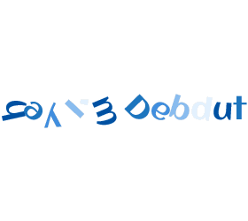

<!--  -->

# Hey,  I'm Debdut

- 🔭 I’m currently working on **Web Development**
- 🌱 I’m currently learning **about life**
- 👯 I’m looking to collaborate on **anything that excites me**
- 🤔 I’m looking for help in **keeping my s\*\*\* together**
- 💬 Ask me **something interesting**
- 📫 How to reach me: **Anywhere you find me**
- 😄 Pronouns: **he**/**him**
- ⚡ Fun fact: I live on **caffine** and **memes**

<!--  -->

---

  <i>Let's connect and chat! Open to anything under the sun.</i>

  

    
    
    
    <!--  -->
  

  

    
  

<!--
**debdutgoswami/debdutgoswami** is a ✨ _special_ ✨ repository because its `README.md` (this file) appears on your GitHub profile.

Here are some ideas to get you started:

- 🔭 I’m currently working on ...
- 🌱 I’m currently learning ...
- 👯 I’m looking to collaborate on ...
- 🤔 I’m looking for help with ...
- 💬 Ask me about ...
- 📫 How to reach me: ...
- 😄 Pronouns: ...
- ⚡ Fun fact: ...
-->
